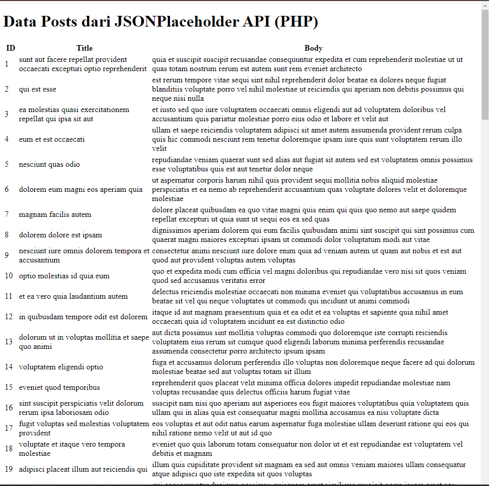
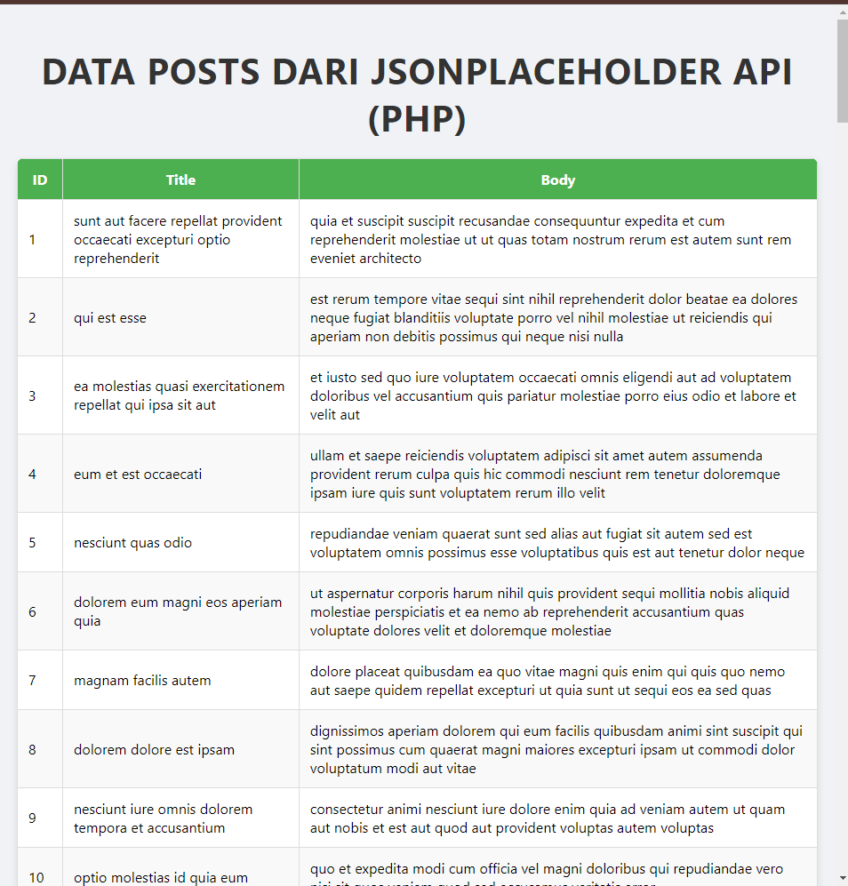
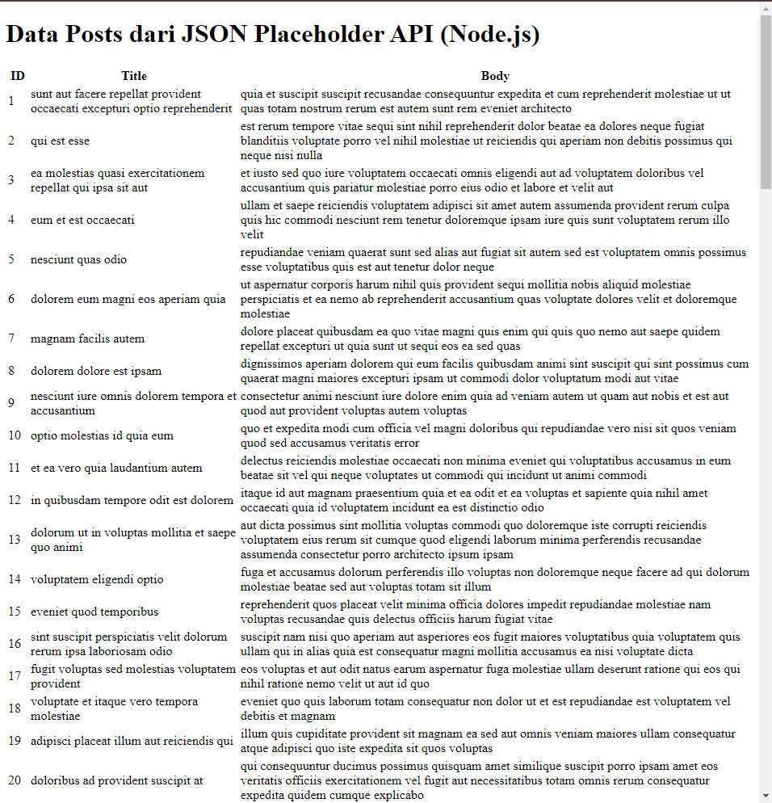
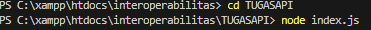
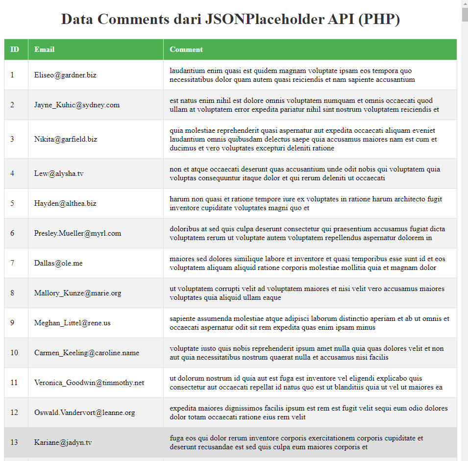
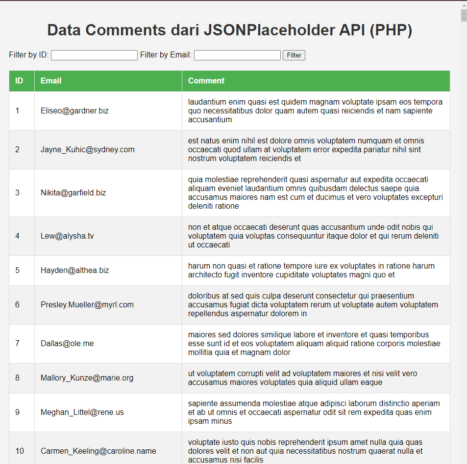
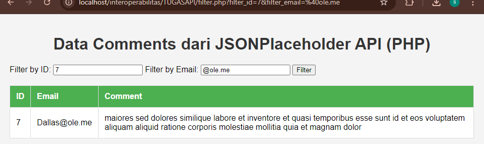

BAGIAN 1: KONSUMSI API MENNGUNAKAN API

Langkah 1:Menampilkan Data dalam Table dengan menggunakan PHP

Langkah 2:Menambahkan CSS untuk PHP

BAGIAN 2: KONSUMSI API MENGGUNAKAN NODE.JS

Langkah 3:  Mengambil data dari API dengan Node.Js

TUGAS PRAKTIKUM:
1. Memodifikasi implementasi PHP atau Node.Js untuk mengambil data dari resource lain

2. Tambahkan fitur filter data berdasarkan ID atau Title

Hasil setelah di coba
